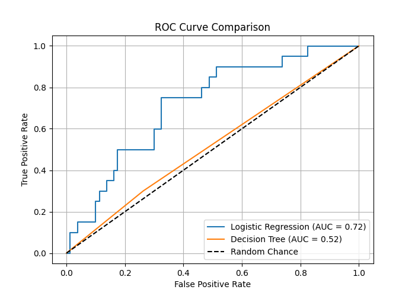

# Credit Risk Lending ML — README

## Part A — Data & Prep

- 400 applicants, default rate **20.25%** (81 defaults)
- `credit_bureau_score` missing in **20%** of rows (80/400) — kept, not dropped, flagged as `is_thin_file`
- Split 75/25, stratified on `default`, `random_state=42` → 300 train / 100 test
- Missing scores filled with the **train median (612.0)** only, applied to both splits — avoids leaking test info
- `employment_type` one-hot encoded (no natural order, so label encoding would be misleading)
- Numeric features scaled with `StandardScaler`, fit on train only

## Part B — Models

| Metric | Logistic Regression | Decision Tree |
|---|---|---|
| Accuracy | 0.76 | 0.65 |
| Precision | 0.39 | 0.22 |
| Recall | 0.35 | 0.30 |
| F1 | 0.37 | 0.26 |
| ROC AUC | **0.72** | 0.52 |

Test set is 80% non-default, so a lazy "predict no default every time" model would hit 80% accuracy too — that's why we're leaning on AUC here, not accuracy. LR actually separates risky from safe applicants; the Decision Tree (AUC 0.52) is basically guessing.

### Risk Pricing Table (using LR probabilities)

| Tier | Applicants | Observed Default Rate | Rate Range |
|---|---|---|---|
| 1 — Low | 25 | 8% | 5.5–7.5% |
| 2 — Med-Low | 25 | 12% | 7.6–10.5% |
| 3 — Med-High | 25 | 20% | 10.6–15.0% |
| 4 — High | 25 | 40% | 15.1–22.0% |

Default rate climbs cleanly tier over tier — the ranking works.

## Part C — Anomaly Detection

Isolation Forest on `txn_hour`, `is_new_device`, `txn_amount_inr`, contamination = 15/265.
**Caught 11 of 15 seeded anomalies → 73.3% recall.**

Optional K-Means: best k = 2 (by Calinski-Harabasz). Clusters split 238 vs 62 applicants, default rates 18.9% vs 25.8% — the smaller cluster runs a bit hotter but nothing extreme.

## Part D — Bias Note

No gender or location field here, but a few columns could still act as proxies. `employment_type` — gig work skews younger and toward certain city/demographic patterns, so penalizing "gig" indirectly penalizes whoever clusters into that group. `monthly_income_inr` can reflect India's gender pay gap and regional income gaps rather than pure creditworthiness. Even `credit_bureau_score` isn't neutral — bureau history is built on past lending, which hasn't been handed out evenly across demographics, so the "traditional" signal can carry the same bias we're trying to work around with alternate data.

**Governance step:** route declined thin-file applicants (`is_thin_file == 1`) through a human reviewer before final rejection. That's exactly the group with the weakest signal (imputed score, no real bureau data) and the most overlap with the proxy risks above — a second set of eyes there matters more than anywhere else in the pipeline.

## Final Call

| Metric | Logistic Regression | Decision Tree | Isolation Forest |
|---|---|---|---|
| AUC | **0.72** | 0.52 | — |
| Recall | 0.35 | 0.30 | 73.3% (anomaly recall) |

**Go with Logistic Regression.** It's the only one of the two that actually ranks applicants by risk (AUC 0.72 vs. a coin-flip 0.52 for the tree), which is what the pricing tiers depend on. It's also easier to explain to a regulator or a declined applicant — coefficients beat tree splits for that. Accuracy looks worse than a lazy baseline for both models, but that's expected on an imbalanced target and not the number to optimize for here.

---

